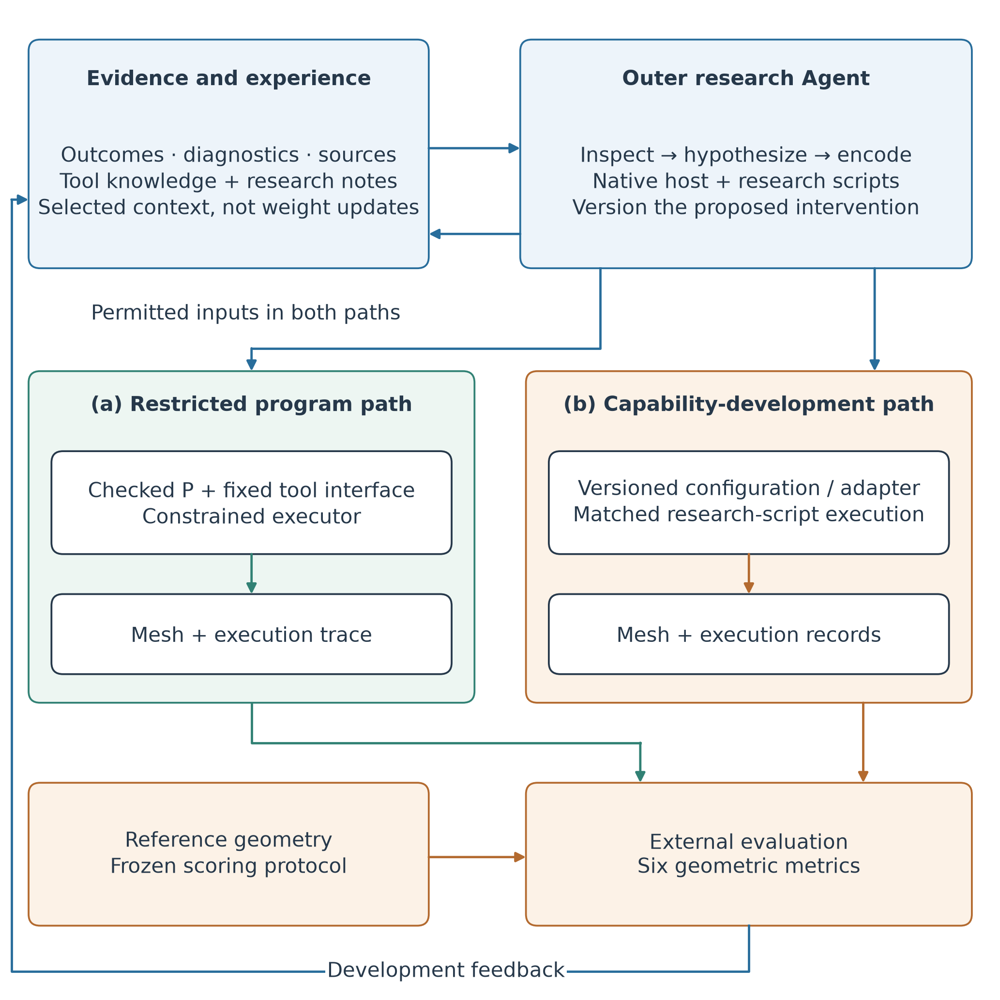

<div align="center">

# GeoPilot
### Feedback-Guided Development of Reconstruction Programs

[Architecture](#architecture) · [Quick check](#quick-check) · [Reproduction](docs/reproduction.md) · [Knowledge & experience](knowledge/README.md) · [Citation](#citation)

**Research code and curated development experience · v0.1.0**

</div>

GeoPilot studies how an Agent can use reconstruction feedback, numerical diagnostics, and tool knowledge to improve executable aerial reconstruction procedures. The system combines an outer research Agent with a constrained program executor and a separate geometric evaluator.

This repository releases the project-specific implementation, experiment entries, selected measurements, and source-linked experience. The manuscript is **in preparation**; there is no claim of journal acceptance or general superiority. The outer workflow currently runs through a host Agent and research scripts, rather than a standalone autonomous service.

## News & timeline

| Date | Milestone | Status |
|---|---|---|
| **2026-09-26** | Initial public research artifact release: system source, architecture, curated knowledge/experience, and measured development outcomes | **v0.1.0** |
| 2026-09-26 | System description expanded to distinguish the outer research Agent from restricted program updates | Documented retrospective boundary |
| 2026-09-25 | Feedback-led shared-intrinsics study completed with favorable changes in all six reported geometry metrics | Single-scene development case |
| 2026-09-23 | P2 received valid development scores; its quality advantage remained unresolved | Historical observation |
| Planned; no date committed | Portable end-to-end data preparation, frozen cross-scene evaluation, and mechanism controls | Open research work |
| Planned; no date committed | Manuscript submission and final publication metadata | Not yet submitted |

Code release dates and research milestones are distinct. Future work is not represented as completed.

## Architecture



1. **Evidence and experience:** record observed outcomes separately from hypotheses, tool knowledge, and conditional guidance.
2. **Outer research Agent:** inspect evidence, formulate a testable intervention, and encode a program/configuration change.
3. **Execution:** run a checked program under a fixed interface, or separately version a capability-development experiment.
4. **Evaluation:** measure the delivered geometry externally and return development feedback.

The two execution paths have different operational boundaries. The restricted launcher uses a macOS sandbox and frozen artifact checks. Research scripts do not inherit that same sandbox automatically. Evaluation references are not reconstruction inputs.

## What the current evidence shows

The outer Agent proposed shared intrinsics **before seeing the resulting mesh improvement**. Starting from the same sparse model, per-image A and shared B received matched bundle adjustment and fresh downstream reconstruction. On these fixed Dataset-1 development products:

| Measure | Per-image A | Shared B | Change |
|---|---:|---:|---:|
| Surface L1 ↓ | 1.989684 m | 1.849701 m | −0.139983 m |
| Surface RMSE ↓ | 2.392473 m | 2.261388 m | −0.131085 m |
| Best-90% L1 ↓ | 1.710132 m | 1.568818 m | −0.141314 m |
| Best-90% RMSE ↓ | 2.018495 m | 1.876745 m | −0.141750 m |
| Precision at 0.20 m ↑ | 6.399900% | 7.846100% | +1.446200 pp |
| Completeness at 0.20 m ↑ | 2.364639% | 3.069519% | +0.704880 pp |

This is a positive **agent-led development case**. It does not isolate the value of feedback versus an always-shared policy, establish repeatability, or demonstrate transfer. One mesh per configuration is not a replicate mean. The absolute errors and low threshold coverage on this input track remain important limitations.

[Measured records](evidence/measurements.json) · [Decision chronology and interpretation](knowledge/shared-intrinsics.md) · [Other outcomes and limitations](knowledge/README.md)

## Quick check

Clone the repository and check the published evidence without data, API credentials, or model calls:

```bash
git clone https://github.com/WdBlink/GeoPilot.git
cd GeoPilot
python3 scripts/verify_artifacts.py
```

Expected: all seven metric records and experience links validate, and the shared-intrinsics deltas match the documented values. This checks the release's internal consistency; it does not recompute LiDAR distances.

For program tests, use Git, Node.js 22.19 or newer, npm and Python 3.10 or newer. Obtain the separately maintained pinned RSI-Harness dependency:

```bash
python3 scripts/setup_upstream.py
node --test --test-skip-pattern='GeoPilot entry uses actual upstream CLI' \
  code/geopilot_rsih/test_program.mjs
```

The excluded integration test requires historical Dataset-1 artifacts; it is not a data-free check.

See [reproduction levels, prerequisites, and tested commands](docs/reproduction.md). Full historical runs depend on separately acquired UseGeo inputs, frozen artifact identities, numerical binaries and the original environment layout. They are not advertised as a one-command result reproduction from this download.

## Repository map

| Path | Content |
|---|---|
| `code/geopilot_rsih/` | Program representation, validation, numerical adapter, isolation and execution |
| `code/usegeo_mesh_baseline/` | Sparse reconstruction and baseline integration |
| `code/usegeo_mesh_benchmark/`, `code/usegeo_benchmark/` | Evaluation and input-contract code |
| `experiments/geopilot_rsih_learning/` | Offline proposal/history, diagnostics, camera controls and evaluation entries |
| `knowledge/` | Tool knowledge and curated positive, mixed and unsuccessful experience |
| `evidence/` | Selected measured fields with original artifact identities |
| `docs/` | Reproduction, data access, system scope and release documentation |
| `assets/` | Original architecture and measured-control figures |

The public knowledge is a **curated snapshot**, not all private session logs. The current compiler consumes selected validly scored historical attempts; an automatic service that distills every crash or failed run into expert rules is not implemented. See [experience reuse](knowledge/README.md).

## Data and dependencies

Acquire imagery and references from their original providers; see [data access](docs/data.md). Raw images, LiDAR, meshes, checkpoints, private sessions, credentials and machine environments are not redistributed.

RSI-Harness is identified by a pinned commit and fetched separately. No license is declared in that pinned snapshot, so its source is not relicensed or bundled here. COLMAP, OpenMVS, UseGeo and model providers retain their respective terms. The GeoPilot release does not include proprietary host software or model weights. See [third-party notices](THIRD_PARTY.md).

## Citation

Use [CITATION.cff](CITATION.cff) to cite this **software artifact**. Paper authors, DOI and publication metadata have not been finalized; no placeholder journal citation is supplied. Please also cite the original reconstruction tools and dataset when using them.

## Contributing & license

Bug reports and focused reproducibility improvements are welcome: [contributing](CONTRIBUTING.md). Do not upload private data or credentials in issues.

Original GeoPilot code, original documentation and curated original knowledge are released under the [MIT License](LICENSE). Third-party material is excluded from that grant; see [THIRD_PARTY.md](THIRD_PARTY.md).
